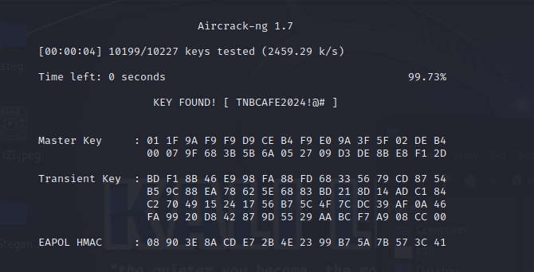

#CTFWi-Fi
-------------------

How to Solve ?
-------------------

- Install aircrack package with `sudo apt-get install aircrack-ng`

- Use aircrack command with the pcap and wordlist given `aircrack-ng TNB-CAFE.cap -w password_list_v2.txt `

Output
-------------------
- 
